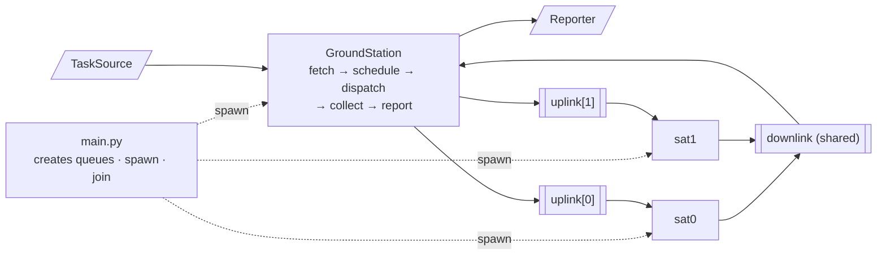

# `satellite-tasking-system`

Given a set of tasks, each with a payoff and a set of mutually exclusive resources, and a
fleet of `N` satellites, it computes the assignment that maximizes total payoff, then
executes it.

A GroundStation reads the task list from an external file, allocates it, and dispatches
one batch per satellite. Each satellite runs in its own OS process, executes its batch and
reports back. The GroundStation prints a summary.



Requires Python 3.12+. There are no runtime dependencies.

## The problem

A task has a `payoff` and a set of exclusive resource ids. A satellite cannot hold two
tasks sharing a resource id; the constraint is per satellite, so two tasks sharing a
resource can still both run if they go to different satellites.

Given `N` satellites, choose which tasks run and on which satellite so that the total
payoff of the tasks that run is maximum. Tasks that fit nowhere are dropped.

With two satellites:

| task                 | payoff | resources |
| -------------------- | ------ | --------- |
| `high_res_capture`   | 10     | {1, 5}    |
| `sensor_maintenance` | 1      | {1, 2}    |
| `comms_test`         | 5      | {5, 6}    |
| `fsck_disk_a`        | 2      | {1, 6}    |

Optimum is 16: `high_res_capture` on one satellite, `sensor_maintenance` + `comms_test` on
the other. `fsck_disk_a` is dropped; any allocation including it is worth at most 12.

Execution is simulated: each task fails with a configurable probability, so the achieved
payoff is usually below the planned one. The designed algorithm is
explained in [Design Decisions](#design-decisions) section.

## Install

```bash
python3 -m venv .venv
source .venv/bin/activate
pip install .
```

## Usage

The install puts a `sat-task-system` command on your PATH. `--tasks` is
required; `--sat-count` defaults to 2:

```bash
sat-task-system --tasks data/spec_tasks.json
sat-task-system --tasks data/spec_tasks.json --sat-count 3
sat-task-system --tasks data/spec_tasks.json --failure-rate 0.0
sat-task-system --tasks data/spec_tasks.json --sat-count 3 --failure-rate 0.1 0.2 0.0
sat-task-system --help
```

`--failure-rate` takes either one value, applied to the whole fleet, or one per satellite.

A run prints the configuration it resolved, then the summary:

```
sat-task-system
  tasks             data/spec_tasks.json
  satellites        2
  failure rates     0.10, 0.10
  collect timeout   5.0s
  join timeout      5.0s

4 tasks, 3 assigned across 2 satellites, 1 skipped

                                    payoff   resources
satellite 0:
  [OK]   high_res_capture             10.0   {1, 5}
satellite 1:
  [OK]   sensor_maintenance            1.0   {1, 2}
  [FAIL] comms_test                    5.0   {5, 6}

skipped:
         fsck_disk_a                   2.0   {1, 6}

planned 16.0   achieved 11.0   (2 of 3 succeeded)
```

`planned` is what the allocation was worth, `achieved` what survived execution:
each task fails with its satellite's `--failure-rate`, so the two rarely match.

### Without installing

```bash
make run
make run ARGS="--sat-count 4"
```

Extra arguments go through `ARGS`: `make` parses anything starting with `-` as
its own option before it looks at the target.

### Docker

```bash
make docker-build
make docker-run
make docker-run ARGS="--sat-count 3"
```

The image ships `data/spec_tasks.json` and runs it by default. To use your own
list, mount the directory holding it and point `--tasks` at it:

```bash
docker run --rm --init -v "$PWD:/data:ro" sat-task-system --tasks /data/my_tasks.json
```

## The task file

A JSON array. Every entry needs the three fields:

```json
[
  { "name": "high_res_capture", "payoff": 10.0, "resources": [1, 5] },
  { "name": "sensor_maintenance", "payoff": 1.0, "resources": [1, 2] },
  { "name": "comms_test", "payoff": 5.0, "resources": [5, 6] },
  { "name": "fsck_disk_a", "payoff": 2.0, "resources": [1, 6] }
]
```

- `name` — unique, human readable id.
- `payoff` — what completing the task is worth.
- `resources` — ids of the exclusive resources it holds. Two tasks sharing a
  resource id cannot sit in the same satellite's queue.

`data/spec_tasks.json` is the list above; `data/benchmark_tasks.json` is a
larger one (50 tasks).

## Tests

```bash
make test          # unit + integration
make test-slow     # the allocator benchmark, deselected by default
make test-all      # everything
make docker-test   # the same suite inside the image, on a clean Python 3.12
```
