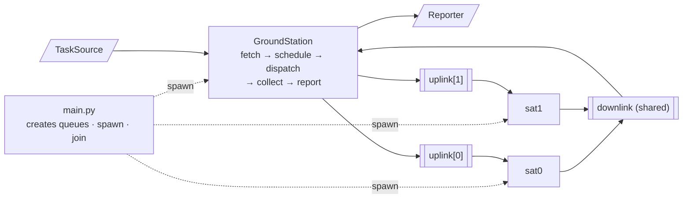

# `satellite-tasking-system`

Given a set of tasks, each with a payoff and a set of mutually exclusive resources, and a
fleet of `N` satellites, it computes the assignment that maximizes total payoff, then
executes it.

A GroundStation reads the task list from an external file, allocates it, and dispatches
one batch per satellite. Each satellite runs in its own OS process, executes its batch and
reports back. The GroundStation prints a summary.



Requires Python 3.12+. There are no runtime dependencies.

## The problem

A task has a `payoff` and a set of exclusive resource ids. A satellite cannot hold two
tasks sharing a resource id; the constraint is per satellite, so two tasks sharing a
resource can still both run if they go to different satellites.

Given `N` satellites, choose which tasks run and on which satellite so that the total
payoff of the tasks that run is maximum. Tasks that fit nowhere are dropped.

With two satellites:

| task                 | payoff | resources |
| -------------------- | ------ | --------- |
| `high_res_capture`   | 10     | {1, 5}    |
| `sensor_maintenance` | 1      | {1, 2}    |
| `comms_test`         | 5      | {5, 6}    |
| `fsck_disk_a`        | 2      | {1, 6}    |

Optimum is 16: `high_res_capture` on one satellite, `sensor_maintenance` + `comms_test` on
the other. `fsck_disk_a` is dropped; any allocation including it is worth at most 12.

Execution is simulated: each task fails with a configurable probability, so the achieved
payoff is usually below the planned one. The designed algorithm is
explained in [Design Decisions](#design-decisions) section.

## Install

```bash
python3 -m venv .venv
source .venv/bin/activate
pip install .
```

## Usage

The install puts a `sat-task-system` command on your PATH. `--tasks` is
required; `--sat-count` defaults to 2:

```bash
sat-task-system --tasks data/spec_tasks.json
sat-task-system --tasks data/spec_tasks.json --sat-count 3
sat-task-system --tasks data/spec_tasks.json --failure-rate 0.0
sat-task-system --tasks data/spec_tasks.json --sat-count 3 --failure-rate 0.1 0.2 0.0
sat-task-system --help
```

`--failure-rate` takes either one value, applied to the whole fleet, or one per satellite.

A run prints the configuration it resolved, then the summary:

```
sat-task-system
  tasks             data/spec_tasks.json
  satellites        2
  failure rates     0.10, 0.10
  collect timeout   5.0s
  join timeout      5.0s

4 tasks, 3 assigned across 2 satellites, 1 skipped

                                    payoff   resources
satellite 0:
  [OK]   high_res_capture             10.0   {1, 5}
satellite 1:
  [OK]   sensor_maintenance            1.0   {1, 2}
  [FAIL] comms_test                    5.0   {5, 6}

skipped:
         fsck_disk_a                   2.0   {1, 6}

planned 16.0   achieved 11.0   (2 of 3 succeeded)
```

`planned` is what the allocation was worth, `achieved` what survived execution:
each task fails with its satellite's `--failure-rate`, so the two rarely match.

### Without installing

```bash
make run
make run ARGS="--sat-count 4"
```

Extra arguments go through `ARGS`: `make` parses anything starting with `-` as
its own option before it looks at the target.

### Docker

```bash
make docker-build
make docker-run
make docker-run ARGS="--sat-count 3"
```

The image ships `data/spec_tasks.json` and runs it by default. To use your own
list, mount the directory holding it and point `--tasks` at it:

```bash
docker run --rm --init -v "$PWD:/data:ro" sat-task-system --tasks /data/my_tasks.json
```

## The task file

A JSON array. Every entry needs the three fields:

```json
[
  { "name": "high_res_capture", "payoff": 10.0, "resources": [1, 5] },
  { "name": "sensor_maintenance", "payoff": 1.0, "resources": [1, 2] },
  { "name": "comms_test", "payoff": 5.0, "resources": [5, 6] },
  { "name": "fsck_disk_a", "payoff": 2.0, "resources": [1, 6] }
]
```

- `name` — unique, human readable id.
- `payoff` — what completing the task is worth.
- `resources` — ids of the exclusive resources it holds. Two tasks sharing a
  resource id cannot sit in the same satellite's queue.

`data/spec_tasks.json` is the list above; `data/benchmark_tasks.json` is a
larger one (50 tasks).

## Tests

```bash
make test          # unit + integration
make test-slow     # the allocator benchmark, deselected by default
make test-all      # everything
make docker-test   # the same suite inside the image, on a clean Python 3.12
```

## Design Decisions

This section summarizes the decisions and the reasoning behind them. The detail lives in
`docs/`, indexed in [`docs/index.md`](docs/index.md).

### Allocation algorithm

The optimizer was first designed for a fleet of two satellites, and the implementation was
later expanded to support N. What follows explains the algorithm with two satellites: it is
the way the problem was originally approached and the clearest one to read. For the full
detail, see [`docs/allocator.md`](docs/allocator.md).

Given a set of `n` tasks, each with its payoff and its set of mutually exclusive resources,
and a fleet of two satellites, we are asked for the distribution of tasks that maximizes
the total payoff with no two tasks sharing a resource on the same satellite. Both decisions
are coupled: giving a task to a satellite consumes its resources and changes what it can
still accept, so they cannot be decided one at a time.

Before going into a search, two cases are worth analyzing, because both are answered
without one:

| case                                          | shortcut                      | cost               |
| --------------------------------------------- | ----------------------------- | ------------------ |
| the fleet is as large as the number of tasks  | one task per satellite        | `O(n)`             |
| every task fits somewhere without conflict     | a greedy pass places them all | `O(n * sat_count)` |

Both collect every task, so there is nothing better to look for.

When neither case applies some task has to be dropped, and choosing which one is the hard
part. The exercise asks to maximize the payoff, not to approximate it, so we search for
the optimum. We build a decision tree with all the possible combinations. Taking the first
task as the root node of our tree, we go down one level through the following three
options:

1. No satellite takes the task
2. The first satellite takes it (if there is no conflict)
3. The second satellite takes it (if there is no conflict)

Each of these decisions is a new node; then the next task is taken and the same three
decisions are analyzed again for every node, forming a ternary decision tree of `3^n` nodes.

To find the optimum we followed a dynamic programming approach. We built a function
`best(task_index, sat1_resources, sat2_resources)` that defines, at each node, the maximum
payoff obtainable from there downwards:

```python
def best(i: int, m1: frozenset[int], m2: frozenset[int]) -> float:
    if i == len(tasks):
        return 0.0

    t = tasks[i]

    r = best(i + 1, m1, m2)                       # nobody takes it

    if not (t.resources & m1):                    # satellite 1 can take it
        r = max(r, t.payoff + best(i + 1, m1 | t.resources, m2))

    if not (t.resources & m2):                    # satellite 2 can take it
        r = max(r, t.payoff + best(i + 1, m1, m2 | t.resources))

    return r
```

The three branches are the three decisions, `max` keeps the best one, and `t.resources &
m1` is the conflict test: a non-empty intersection means that satellite cannot take the
task.

As written, it walks the whole tree. Memoization is what makes it tractable: many decision
sequences lead to the same state, and how satellite 1 came to hold {1, 5} does not matter,
only that it holds it, so identical arguments have identical answers and are computed once.
The cost becomes the number of reachable states instead of the `3^n` paths of the tree.
`Task.resources` is a `frozenset` and not a `set` precisely so the state can be a dict key.

Two optimizations followed:

1. **Integer bitmasks instead of sets** (`1 << r`), so the conflict test is a single `&` and
   the state is cheaper to hash. Runtime dropped by almost half.

2. **Symmetric states collapse.** The satellites are interchangeable, so sorting the masks
   before building the memo key maps mirrored states to a single entry, roughly halving them.

`best()` returns a payoff, but the GroundStation needs to know which task goes where. Since
every reachable state is already in the memo, a second pass walks the tasks forward and
follows any branch that reproduces the known optimum, which is a branch the optimum could
have taken. Every lookup is a memo hit, so the pass is `O(n)`.

Support for N satellites came last: the two masks become a tuple of `sat_count` masks, at
roughly 1.5x the runtime, which is the price of a configurable fleet size. With a larger
fleet, placements often tie at the optimum, and the pass keeps the least loaded satellite
instead of the first one it finds, so batches spread instead of piling onto satellite 0.

#### Limits

With `n` tasks, `R` distinct resources and `N` satellites, a state is a task index plus
one mask per satellite, so the state space is bounded by `n * (2^R)^N`. Measured for 50
tasks / 10 resources / 2 satellites takes ~6s, 6.3M calls and ~2.5M memoized states.

#### Reading the evolution

The allocator was committed in stages, from the most naive correct version to the
current one, and each stage is tagged `stage1`..`stage8`:

```bash
git log --oneline stage1..stage8
git show stage3        # sets become bitmasks
```

### IPC mechanism

Once the optimal assignment is known, the ground station has to hand each satellite its
share of the work and wait for its results. The exercise requires the station and the
satellites to be separate processes, so a mechanism to communicate between them (IPC) had to
be defined.

The initial idea was to reproduce the space links of a real satellite communication: the
station broadcasts its messages to the whole fleet and each satellite checks whether the
message received is addressed to it, while each satellite, on finishing its tasks, transmits
its results individually to a single ground station, which has to tell which satellite each
result came from.

A PUB/SUB bus, the station publishing, every satellite subscribing, was evaluated for the
uplink and discarded: a subscriber that joins late loses whatever was published before it
connected, and having every satellite validate its own id is clumsy work that buys nothing.
The uplink ended up as one exclusive queue per satellite, with the station holding an array
of those queues indexed by satellite id. 

The downlink is the opposite, a single queue shared by the whole fleet. Every result carries
the id of the satellite that produced it, so merging the streams loses nothing, and the
station simply reads the next message as it arrives instead of polling the satellites one by
one, which is what per-satellite downlinks would force.

Both links are `multiprocessing.Queue` objects. They give exactly what the design needs:
dedicated queues for the uplinks, a shared one for the downlink, and process-safe
operation without implementing explicit mutexes. They come with the standard library, so
there is no broker to deploy, and they are kept behind a thin wrapper in
`ipc/channels.py`, so the transport can be replaced without touching the processes.


Finally, to keep a missing result from blocking the run forever, the station knows how many
responses to expect before it dispatches anything, one per assigned task, so collecting is a
bounded loop rather than a wait for sentinels or a check for live processes. Each read
carries a configurable timeout, and if it fires with responses still missing, the station
matches the task names it dispatched against the names that reported back and records the
outstanding ones as failed. A dead satellite then costs the run its payoff instead of its
report.

[`docs/ipc.md`](docs/ipc.md) covers the transport in detail: the channel types, the
addressing constraint, the message envelopes, and the termination path.
