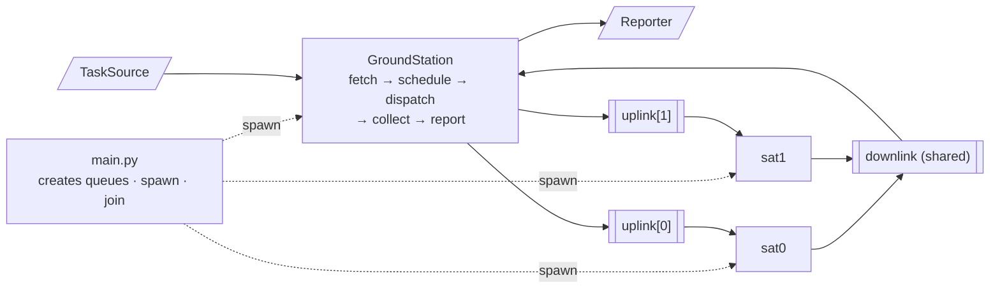

# Architecture

Scope: process topology, layering, the actors and the two injected edges. The allocation
algorithm is covered in `docs/allocator.md`, the transport in `docs/ipc.md`, the HTTP front
end in `docs/web.md`.

## Execution path

A `GroundStation` loads a batch of tasks, computes the payoff maximizing assignment across
the fleet, sends each satellite its own batch, collects one result per dispatched task, and
publishes a summary. `Satellite` processes execute what they are given, one task at a time,
with a configurable chance of failure.



The arrows on the sides are the seams: task input and summary output are both injected, so
neither is hardcoded into the station.

## Layering

| package      | role                       | may import                    |
| ------------ | -------------------------- | ----------------------------- |
| `domain/`    | pure business logic        | nothing from this project     |
| `ports/`     | the two abstract edges     | `domain/`                     |
| `loaders/`   | task input adapters        | `domain/`, `ports/`           |
| `reporting/` | summary output adapters    | `domain/`, `ports/`           |
| `ipc/`       | transport mechanism        | `domain/`                     |
| `config.py`  | runtime configuration      | nothing from this project     |
| `processes/` | the actors, orchestration  | all of the above              |
| `web/`       | HTTP front end             | all of the above              |
| `main.py`    | entry point, mode dispatch | all of the above              |

Every dependency points inward. `domain/allocator.py`, `domain/models.py` and
`domain/summary.py` import nothing but the standard library, which is why the allocation
algorithm and the summary builder are tested without starting a process.

This is ports and adapters in substance, with conventional names: there is no `adapters/`
directory and no dependency injection container. The property that matters, that the core
does not know how tasks arrive or where results go, is carried by the import rules above.

## Process topology

Three roles, four processes on a command line run: `main.py` is a launcher, and the station
runs in a process of its own alongside the satellites.

The station is a process rather than the launcher itself so that its lifetime is independent
of the program's. An entry point cannot outlive the run it starts, while a process can keep
serving batches for as long as its task source produces them. Keeping the two separate means
the station's lifetime is a property of the station and not of the process tree.

`processes/fleet.py` holds what is common to every run: `satellite_processes()` builds one
`Process` per satellite from the failure rates, and `shutdown()` joins each with a timeout
and terminates whatever did not come back.

The station is hosted, not fixed to a process of its own. The HTTP front end hosts it in the
server process, which is what lets a request read the summary of the run it started; the
satellites are processes either way. That variant is documented in `docs/web.md`.

Queue creation happens in whichever module composes the run, for a constraint of the
primitive documented in `docs/ipc.md`: queues reach a child only by being passed to the
`Process` constructor.

## GroundStation

`run()` is the five phases of a run, in order:

```python
def run(self) -> None:
    tasks = self._source.fetch()
    assignments = self.schedule(tasks)
    self.dispatch(assignments)
    results = self.collect(assignments)
    self.report(tasks, assignments, results)
```

| phase      | delegates to                                        | layer            |
| ---------- | --------------------------------------------------- | ---------------- |
| `fetch`    | `TaskSource`                                        | adapter          |
| `schedule` | `domain.allocator.allocate`                         | domain, pure     |
| `dispatch` | one `ExecuteTasks` per uplink                       | ipc              |
| `collect`  | bounded reads off the downlink, each with a timeout | ipc              |
| `report`   | `build_summary`, then `Reporter`                    | domain + adapter |

The station coordinates, it does not compute. Both computations it touches are pure
functions in `domain/`, tested with in memory lists: `allocate` decides the plan, and
`build_summary(tasks, assignments, results)` turns raw results into the report.

Every phase takes what it needs as an argument and returns what it produced, so the plan is
a local in `run()` rather than instance state. The station's attributes are exactly what was
injected into it, and nothing accumulates across phases. Two consequences: a phase can be
called on its own in a test, handed a plan written by hand instead of one the allocator
computed, and there is no mutable field for two phases to disagree about.

There is one `GroundStation` class and it is concrete. The sequence above is the only
orchestration the system performs; what varies is at its two ends.

## The two edges

`ports/` declares what the station needs from the outside world, one module per edge, each
carrying the contract its implementers have to honour:

```python
# ports/task_source.py
class TaskSource(ABC):
    @abstractmethod
    def fetch(self) -> list[Task]: ...

# ports/reporter.py
class Reporter(ABC):
    @abstractmethod
    def publish(self, summary: Summary) -> None: ...
```

A concrete pair is named only where a run is composed, so changing either end is a change to
the wiring and nothing else:

```python
station = GroundStation(
    source=JsonTaskSource(config.tasks_path),
    reporter=ConsoleReporter(),
    collect_timeout=config.collect_timeout,
    channels=channels,
    sat_count=config.sat_count,
)
```

There are two such places, one per front end, and the pair is the only difference between
them:

| edge         | command line        | HTTP                   |
| ------------ | ------------------- | ---------------------- |
| `TaskSource` | `JsonTaskSource`    | `InMemoryTaskSource`   |
| `Reporter`   | `ConsoleReporter`   | `CapturingReporter`    |

The station holds the abstract types, so a different source of tasks or a different
destination for the summary is a new class plus one line of wiring, with no change to the
orchestration. Adding the second front end changed no line of `GroundStation`. Nothing in the station constrains how many destinations a `Reporter` writes
to either, since a `Reporter` that forwards to other reporters satisfies the same contract.

Both edges are abstract classes rather than injected callables for a concrete reason: on a
command line run the station runs in a child process, so under the `spawn` start method it
is pickled together with whatever was injected into it. A class holding a path string pickles cleanly, a lambda
does not pickle at all. Abstract classes also allow shared implementation, for example a
base `publish()` that formats a `Summary` and leaves only the destination to subclasses.

Overrides carry `@typing.override` (Python 3.12+). It changes nothing at runtime and turns a
misspelled or re-signatured override into a type error instead of a method that is silently
never called.

## Satellites

```python
class Satellite:
    def __init__(self, sat_id: int, failure_rate: float,
                 uplink: Queue[ExecuteTasks],
                 downlink: Queue[TaskExecuted]): ...

    def run(self) -> None: ...
```

`run()` blocks on its own uplink for one `ExecuteTasks`, executes the assigned tasks in
order while emitting one `TaskExecuted` per task, and returns. A satellite serves a single
batch and exits: no second wave is sent, so there is no receive loop and no shutdown message
to interpret. Both would be local to this class.

`Satellite` is a plain class composed with a process, `Process(target=sat.run)` in
`processes/fleet.py`, rather than a `Process` subclass. Keeping the two separate means `run()` can be
called directly in a test with ordinary `queue.Queue` objects, with no `start()`/`join()`
and no process teardown. It also keeps the promise `ipc/` exists to make: the actor does not
know what the transport is.

Failure simulation draws from a per instance `random.Random()` rather than the module
level `random`. Satellite count and per satellite failure rates come from `config.py`, so
varying the fleet is a parameter rather than a code change.
