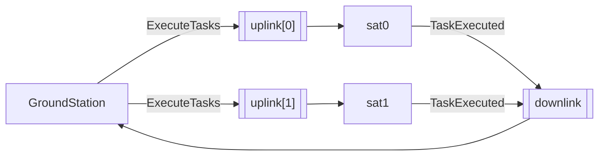

# IPC

Scope: the transport between the ground station and the satellite processes. The allocation
algorithm is covered in `docs/allocator.md`, the rest of the design in
`docs/architecture.md`, and the front end that hosts the station itself in `docs/web.md`.

## Requirements

The station dispatches one batch per satellite and then waits for one result per dispatched
task. That interaction imposes four requirements on the transport:

1. Addressed delivery, station to satellite: a batch must reach one specific satellite.
2. Convergent delivery, satellite to station: results from the whole fleet must reach a
   single reader, each one identifying its sender.
3. Blocking receive, so neither side polls.
4. Process safety without explicit locking.

`multiprocessing.Queue` satisfies 3 and 4 directly: it is a process-safe FIFO with a
blocking `get()`, it belongs to the standard library, and it requires no broker. Requirements
1 and 2 are satisfied by the topology, not by the primitive.

## Topology

N addressed uplinks, one shared downlink, shown here for a fleet of two:



One command goes up per satellite, one event comes back per executed task. Both directions
are declared together, so the fleet size is the only parameter of the transport:

```python
@dataclass(frozen=True)
class Channels:
    # one uplink per satellite, index == sat_id
    uplinks: tuple[Queue[ExecuteTasks], ...]

    # shared by all satellites
    downlink: Queue[TaskExecuted]
```

`ipc/channels.py` is the only module that names the primitive. `processes/` operates on
`Channels`, which is what makes the transport replaceable.

## Uplink: one queue per satellite

A queue delivers each message to exactly one reader, and that reader is whichever consumer
calls `get()` first. Addressing a specific satellite therefore requires a dedicated queue
per satellite. With `uplinks` indexed by satellite id, dispatch is a direct lookup:

```python
def dispatch(self, assignments: list[Assignment]) -> None:
    for a in assignments:
        self._channels.uplinks[a.satellite_id].put(ExecuteTasks(a))
```

The satellite id is already carried by the `Assignment`, so the index and the payload
agree by construction. The receiving satellite still validates it and raises
`MisroutedCommandError` on mismatch: an uplink belongs to one satellite, so a foreign id
means the station indexed the wrong queue, and executing another satellite's batch would
report plausible results under the wrong id.

## Downlink: one shared queue

Results converge on a single queue. Every `TaskResult` carries its `satellite_id`, so
merging the streams loses no information and the collect loop is a single blocking read.

Per-satellite downlinks were rejected for a concrete reason: there is no portable way to
wait on several `multiprocessing.Queue` objects at once (`multiprocessing.connection.wait()`
accepts `Pipe` connections, not queues). The station would have to poll each queue with a
short timeout and implement its own fairness policy, which adds code and latency without
adding capability.

## Rejected alternative: PUB/SUB bus

Mirroring a real space link would make the uplink a broadcast medium, with the station
publishing to the fleet and each satellite filtering on its own id. Two arguments against
it at this scale:

1. Slow joiner. A subscriber that connects after a message is published does not receive it.
   Correctness would require a barrier where the station waits for N ready signals before
   dispatching, which is more code than the whole queue based implementation.
2. Cost inversion. Over a radio link broadcast is free and addressing must be built. Inside
   a single host the opposite holds: addressing is a tuple index, while broadcast has to be
   emulated by publishing N copies for N-1 readers to discard.

## Messages

| message        | kind    | direction           | payload          |
| -------------- | ------- | ------------------- | ---------------- |
| `ExecuteTasks` | command | station to satellite | one `Assignment` |
| `TaskExecuted` | event   | satellite to station | one `TaskResult` |

```python
@dataclass(frozen=True, slots=True)
class ExecuteTasks:
    assignment: Assignment


@dataclass(frozen=True, slots=True)
class TaskExecuted:
    result: TaskResult
```

Payloads are domain types, unmodified for the wire. `ExecuteTasks` carries the entire batch
in one message rather than one message per task: `Assignment` is the unit that guarantees
the batch is resource disjoint, and splitting it would make that guarantee travel
implicitly.

The plural/singular asymmetry is deliberate: one batch goes up, one result per task comes
back.

## Termination

The expected number of results is known before anything is dispatched, so collection is a
bounded loop. No sentinel values, no liveness checks, and no shutdown handshake:

```python
task_count = sum(len(a.tasks) for a in assignments)

results: list[TaskResult] = []
for _ in range(task_count):
    try:
        message = self._channels.downlink.get(timeout=self._collect_timeout)
    except Empty:
        break
    results.append(message.result)
```

The timeout is per message rather than a deadline for the phase, because the condition to
detect is silence, not slowness: a healthy run may be slow, and one satellite failing while
others keep reporting must not trip it. Note that `Empty` comes from the standard `queue`
module; `multiprocessing` does not define it.

A simulated task failure does not affect the count, since the satellite reports
`success=False` and continues. A satellite dying does, so outstanding results are completed
as failures by set difference over `(satellite_id, task_name)` pairs:

```python
for sat_id, task_name in expected - received:
    results.append(TaskResult(task_name, sat_id, False))
```

From the station, a task that never reported within the window is indistinguishable from a
failed one, and its payoff is correctly excluded from the achieved total. The count
invariant that `build_summary` relies on stays intact, so a partial run reports instead of
raising.

Teardown is `shutdown()` in `processes/fleet.py`, shared by both front ends: it joins each
process with a timeout and terminates whatever is still blocked.

```python
for process in processes:
    process.join(timeout=timeout)

    if process.is_alive():
        process.terminate()
        process.join()
```

A front end that hosts the station calls it from a `finally`, so a station raising mid run
cannot leave satellites blocked on their uplinks for the lifetime of the server.

Draining before joining is the required order for `multiprocessing` queues. A process that
wrote to a queue does not exit until its feeder thread flushes the pickled bytes into the
underlying pipe, and a full pipe blocks that thread. At this scale the risk is theoretical,
but the ordering is free, and the join timeout guarantees that a wedged satellite cannot
hang the program after the station has stopped waiting for it.
