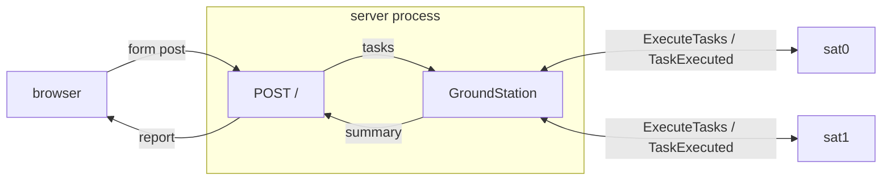

# Web interface

Scope: the HTTP mode, what it reuses and the one structural decision it forced. The
transport is covered in `docs/ipc.md`, the layering in `docs/architecture.md`, the
allocation algorithm in `docs/allocator.md`, and what a run leaves behind in
`docs/persistence.md`.

## What it is

A single page: a task list is pasted on the left, a run is launched, and the report comes
back on the right. It is the same report the command line prints, produced by the same
fleet, because the only things that change are the two adapters at the ends of the station.

Flask is not a runtime dependency of the system. It is declared as an optional extra
(`pip install '.[web]'`), and `main.py` imports the web module inside the branch that needs
it, so a command line run works with the extra absent.

## Where the station runs

The command line mode gives the station a process of its own. The web mode cannot: a
`Reporter` publishing inside a child process has no way to hand the `Summary` back to the
request that started the run.

So in web mode the server process **is** the ground station. The satellites keep their own
processes, so a submission still runs a real fleet.



| mode  | processes                                       |
| ----- | ----------------------------------------------- |
| `cli` | launcher, station, N satellites                 |
| `web` | server hosting the station, N satellites        |

Nothing in `GroundStation` changed for this. The station never referenced the process it
runs in, so hosting it in the caller's process is a wiring decision, not a modification.

## One batch per submission

`processes/fleet.py` holds the orchestration both modes share. `satellite_processes()` and
`shutdown()` are used by each; `run_batch()` is the web mode's composition root:

```python
def run_batch(tasks: list[Task], config: Config) -> Summary:
    channels = create_channels(config.sat_count)
    satellites = satellite_processes(config.failure_rates, channels)

    capture = CapturingReporter()
    station = GroundStation(source=InMemoryTaskSource(tasks),
                            reporter=MultiReporter((capture, *reporters)), ...)

    for process in satellites:
        process.start()

    try:
        station.run()
    finally:
        shutdown(satellites, config.join_timeout)

    return capture.summary
```

The `finally` is what keeps a server alive across a failed run: an exception inside the
station would otherwise leave N satellites blocked on their uplinks for the lifetime of the
process, and the next submission would add N more.

`reporters` is how a caller adds destinations without giving up the summary it needs back.
The web mode passes the SQLite recorder there when a history file is configured, and the
capture stays first in the list, so the summary is in hand before anything durable is
attempted with it.

Each submission builds its own channels and its own fleet. Satellites stay single batch, so
no receive loop and no shutdown message are needed on the satellite side.

## The two adapters

The mode is a pair of implementations of the ports the station already declared:

| edge         | `cli`               | `web`                  |
| ------------ | ------------------- | ---------------------- |
| `TaskSource` | `JsonTaskSource`    | `InMemoryTaskSource`   |
| `Reporter`   | `ConsoleReporter`   | `CapturingReporter`    |

`InMemoryTaskSource` holds a list that was already parsed. `CapturingReporter` keeps the
`Summary` instead of writing it, and exposes it through a property that raises if the run
never reached its report, so a missing summary is an error rather than a `None` travelling
further.

`Reporter.publish()` returns nothing, which is the reason the capture and the rendering are
two separate steps: the port carries the summary out of the station, and the caller decides
what to do with it.

## Validation happens before the fleet

The submitted text is parsed in the request handler, not inside the station:

```python
try:
    tasks = parse_tasks(json.loads(submitted))
except ValueError as error:
    return _page(config, submitted, error=str(error)), 400
```

`parse_tasks()` is the half of the JSON loader that never touches disk, which is what makes
it reusable here: a pasted list gets the same validation, and the same per-field messages,
as a file. `json.JSONDecodeError` is a subclass of `ValueError`, so one `except` covers both
the decoding and the validation.

The order matters. A malformed list returns before `create_channels()`, so nothing was
spawned, nothing has to be reaped, and the response is immediate. The status code says the
same thing: the request was wrong, not the server.

## One run at a time

A module level lock, acquired without blocking:

```python
if not running.acquire(blocking=False):
    return _page(config, submitted, error=BUSY), 409
```

Two concurrent submissions would mean two fleets competing for the same machine, with
interleaved execution and two reports of unrelated runs. Refusing the second is the honest
small answer at this scale; a job queue is the real one, and is not in scope.

The page states the same rule earlier: on submit, the button is disabled and the report
panel is cleared, so a long run cannot be mistaken for a finished one and the previous
report cannot be mistaken for the new one.

## Rendering

`reporting/text_report.py` owns the layout, as one function:

```python
def render_summary(summary: Summary) -> str
```

`ConsoleReporter.publish()` is a `print` of it, and the page puts it inside a `<pre>`. The
two front ends therefore cannot drift: there is one implementation of what a report looks
like, and the web output is byte for byte what the terminal shows.

That is the whole reason the layout was extracted out of `ConsoleReporter`. A second
formatter would have been a second thing to keep in sync with the first.

## History

`GET /history` lists the recorded runs, newest first, each expandable into the tasks it
accounted for. It is a second read of the same store the recorder writes to, described in
`docs/persistence.md`.

The whole feature is guarded by one condition, `config.db_path is not None`: with no history
file the nav link is not rendered, and the route answers that nothing is being recorded
rather than showing an empty page that looks like a lost history.

Both pages extend `templates/base.html`, which carries the styles, the header and the nav.
The alternative was one self-contained page per route, which duplicates the styles and lets
the two drift apart.

## Mode selection

`config.py` carries the mode as data, so nothing downstream branches on a flag:

| flag                | effect                                                      |
| ------------------- | ----------------------------------------------------------- |
| `--cli` (default)   | one batch from `--tasks`, report on stdout                  |
| `--web`             | serve the page on `--host` / `--port`                       |
| `--db`              | record every run in that SQLite file, and serve `/history`   |

`--tasks` is required in `cli` mode only, and `Config.__post_init__` is what enforces it,
alongside the other rules. In `web` mode the flag is the initial content of the box and
nothing more: the tasks of a run always come from the request, so the mode has no
dependency on the filesystem.

## Packaging

The template is data, not a module, so package discovery would leave it out of the wheel:

```toml
[tool.setuptools.package-data]
"sat_task_system.web" = ["templates/*.html"]
```

`Flask(__name__)` resolves `templates/` next to `web/app.py`, which holds both from the
source tree and from an installed package.

The image gets a `web` stage of its own, so the default runtime image stays free of Flask.
It binds `0.0.0.0`, since a server bound to the container's loopback is unreachable from a
published port, and it records to a directory created for the unprivileged user it runs as:
`/app` belongs to root, so a history file placed there could not be written.

## Limits

- The development server. Suitable for driving a local fleet, not for concurrent users;
  the one-run-at-a-time rule is the ceiling anyway.
- History is opt in, and is the most recent runs of one file with no pruning and no
  pagination. Its own limits are in `docs/persistence.md`.
- Long lists are answered synchronously: the request stays open for as long as the search
  and the execution take, and the allocation limits in `docs/allocator.md` apply unchanged.
